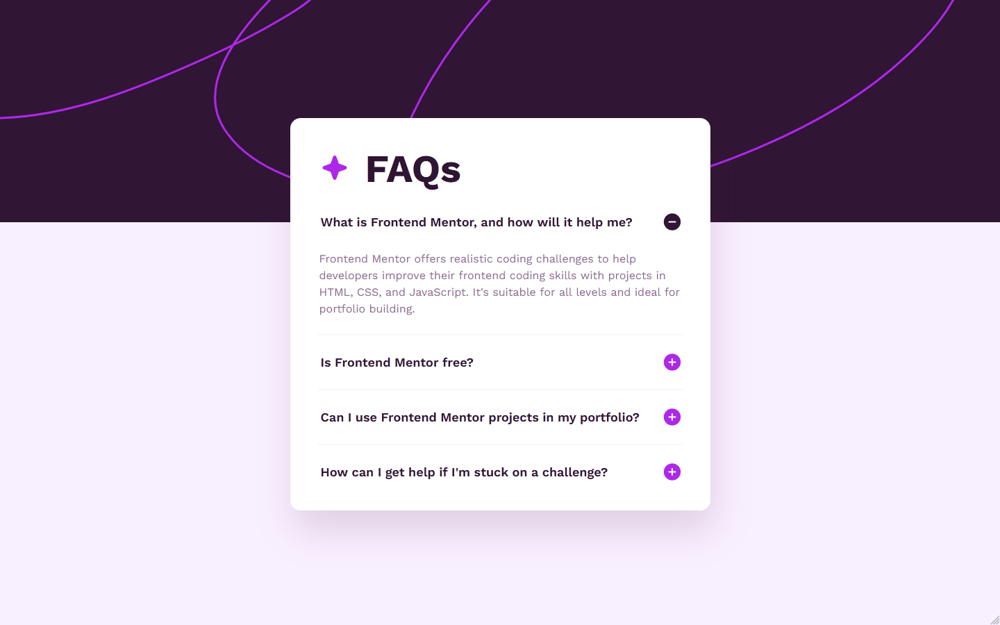

# Frontend Mentor - FAQ accordion solution

This is a solution to the [FAQ accordion challenge on Frontend Mentor](https://www.frontendmentor.io/challenges/faq-accordion-wyfFdeBwBz). Frontend Mentor challenges help you improve your coding skills by building realistic projects. 

## Table of contents

- [Overview](#overview)
  - [The challenge](#the-challenge)
  - [Screenshot](#screenshot)
  - [Links](#links)
- [My process](#my-process)
  - [Built with](#built-with)
  - [What I learned](#what-i-learned)
- [Author](#author)

## Overview

### The challenge

Users should be able to:

- Hide/Show the answer to a question when the question is clicked
- Navigate the questions and hide/show answers using keyboard navigation alone
- View the optimal layout for the interface depending on their device's screen size
- See hover and focus states for all interactive elements on the page

### Screenshot

### Links

- Solution URL: [Github](https://github.com/Absynthee/faq-accordion-main-v2)
- Live Site URL: [Github Pages](https://absynthee.github.io/faq-accordion-main-v2/)

## My process

### Built with

- HTML
- CSS
- CSS custom properties

### What I learned

I decided to revisit this project to make a few changes, most notably replacing the accordion & panel divs with detail & summaries and removing the JavaScript so it is purely CSS. This reduces complexity and makes improves the code semantically. 

## Author

- Website - [Austin Spillman](https://www.austinspillman.com)
- Frontend Mentor - [@Absynthee](https://www.frontendmentor.io/profile/Absynthee)
